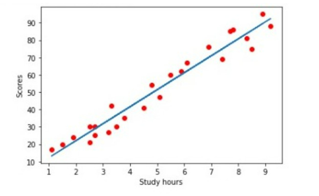

# Implementation-of-Linear-Regression-Using-Gradient-Descent

## AIM:
To write a program to predict the profit of a city using the linear regression model with gradient descent.

## Equipments Required:
1. Hardware – PCs
2. Anaconda – Python 3.7 Installation / Jupyter notebook

## Algorithm
1. Start the program
2.Import the numpy.pandas and matplotlib
3.Read the file which store the data
4.Declare x as hours and y as scores of the data
5.Using loop predit the data and find the y-intercept, slope using the formulae.
6.Find the best fit using the straight line formula
7.Display the data in graph using the matplotlib libraries
8.Stop the Program.

## Program:
```
/*
Program to implement the linear regression using gradient descent.
Developed by: prathima
RegisterNumber:  212220040156
import numpy as np
import pandas as pd
import matplotlib.pyplot as plt
dataset=pd.read_csv("/content/student_scores.csv")
dataset.head()
dataset.isnull().sum()
x=dataset.Hours
x.head()
y=dataset.Scores
y.head()
n=len(x)
m=0
c=0
L=0.01
loss=[]
for i in range(10000):
  ypred=m*x+c
  MSE=(1/n)*sum((ypred-y)*2)
  dm=(2/n)*sum(x*(ypred-y))
  dc=(2/n)*sum(ypred-y)
  c=c-L*dc
  m=m-L*dm
  loss.append(MSE)
  print(m,c)
  y_pred=m*x+c
plt.scatter(x,y,color='red')
plt.plot(x,y_pred)
plt.xlabel("Study hours")
plt.ylabel("Scores")
plt.title("Study hrs vs Scores")
plt.plot(loss)
plt.xlabel("iterations")
plt.ylabel("loss")
*/
```

## Output:

)


## Result:
Thus the program to implement the linear regression using gradient descent is written and verified using python programming.
